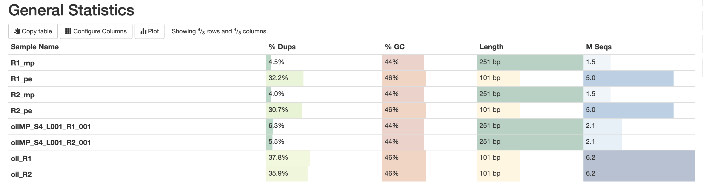
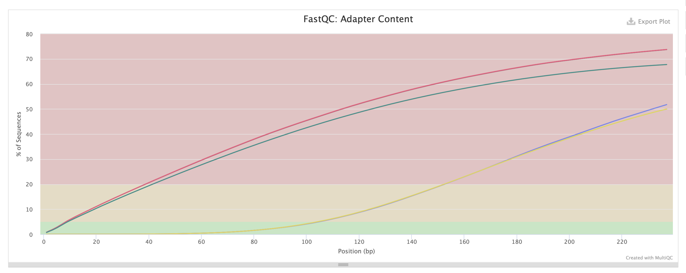

# hse21_hw1
Основные команды, выполненые на сервере

```bash
Для начала берем нужное нам количество рандомных чтений
seqtk sample -s1110 oil_R1.fastq 5000000 > R1_pe.fastq
seqtk sample -s1110 oil_R2.fastq 5000000 > R2_pe.fastq
seqtk sample -s1110 oilMP_S4_L001_R1_001.fastq 1500000 > R1_mp.fastq
seqtk sample -s1110 oilMP_S4_L001_R2_001.fastq 1500000 > R2_mp.fastq


Изучаем их
mkdir fastqc
ls *.fastq | xargs -P 4 -tI{} fastqc -o fastqc {}
mkdir multiqc
multiqc -o multiqc fastqc


Вырезаем все ненужное 
platanus_trim R1_pe.fastq R2_pe.fastq 
platanus_internal_trim R1_mp.fastq R2_mp.fastq 


Собираем геном
time platanus assemble -o Poil -t 2 -m 16 -f trimed_fastq/R1_pe.fastq.trimmed trimed_fastq/R2_pe.fastq.trimmed 2> assemble.log
time platanus scaffold -o Poil -t 2 -c Poil_contig.fa -IP1 trimed_fastq/R1_pe.fastq.trimmed trimed_fastq/R2_pe.fastq.trimmed -OP2 trimed_fastq/R1_mp.fastq.int_trimmed trimed_fastq/R2_mp.fastq.int_trimmed 2> scaffold.log
time platanus gap_close -o Poil -t 2 -c Poil_scaffold.fa -IP1 trimed_fastq/R1_pe.fastq.trimmed trimed_fastq/R2_pe.fastq.trimmed -OP2 trimed_fastq/R1_mp.fastq.int_trimmed trimed_fastq/R2_mp.fastq.int_trimmed 2> gapclose.log
```

## Исходные данные




## После обрезания

